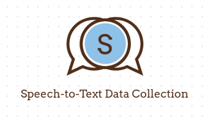

# Speech-to-Text Data Collection

A tool that can be deployed to process posting and receiving text and audio files from and into a data lake, apply transformation in a distributed manner, and load it into a warehouse in a suitable format to train a speech-to-text model.

## Data Capture Pipeline


## Directory Structure

```bash
.
├── airflow
│   ├── dags
│   │   ├── extract_load.py
│   │   └── scripts
│   │       ├── dataloader.py
│   │       ├── db_connection.py
│   │       ├── __init__.py
│   │       └── schema
│   │           └── amharicnews.sql
│   ├── data
│   │   └── AmharicNewsDataset.csv
│   ├── docker-compose.yaml
│   └── logs
│       └── scheduler
│           └── latest -> /opt/airflow/logs/scheduler/2022-10-05
├── backend
│   └── dummy.txt
├── frontend
│   ├── dummy.txt
│   ├── frontend
│   │   ├── package.json
│   │   ├── package-lock.json
│   │   ├── public
│   │   │   ├── favicon.ico
│   │   │   ├── index.html
│   │   │   ├── logo192.png
│   │   │   ├── logo512.png
│   │   │   ├── manifest.json
│   │   │   └── robots.txt
│   │   ├── README.md
│   │   └── src
│   │       ├── App.css
│   │       ├── App.js
│   │       ├── App.test.js
│   │       ├── index.css
│   │       ├── index.js
│   │       ├── logo.svg
│   │       ├── reportWebVitals.js
│   │       └── setupTests.js
│   └── proto.png
├── img
│   ├── logo.png
│   └── pipelineDiagram.png
├── LICENSE
├── logging
│   └── dummy.txt
├── notebook
│   └── Amharic_news_Classification.ipynb
├── README.md
├── requirements.txt
├── screenshots
│   ├── airflowscreenshoot.png
│   └── design diagram.png
└── testing
    ├── dummy.txt
    └── test_dataloading.py

17 directories, 39 files

```

## Run Locally

Clone the project

```bash
  git clone https://github.com/create-speech-to-text-pipeline/pipeline
```

Go to the project directory

```bash
  cd pipeline
```

Install dependencies

```bash
  pip3 install -r requirements.txt
```

Set up pipeline

```bash
  python3 setup.py
```

## Screenshots


## Authors

- [Haylemicheal](https://github.com/Haylemicheal)
- [Janerose](https://github.com/KaydeeJR)
- [Mohammed](https://github.com/MohammedEsamaldin)
- [Nahom](https://github.com/nahomHmichael)
- [Patrick](https://github.com/prubayita)
- [Wangui](https://github.com/akrobi)
- [Yonas](https://github.com/yonamg)
